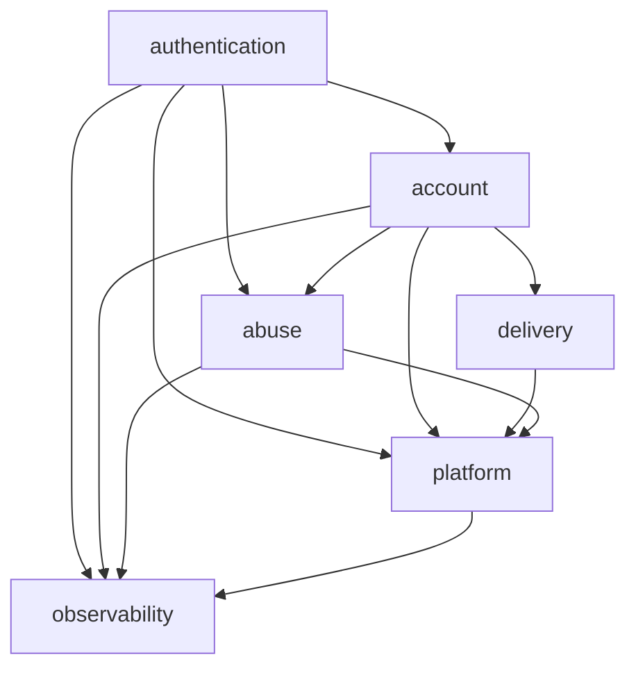

# Authentication Service Template

Production-minded authentication foundation built with Java 25, Spring Boot 4.1.1, Spring Security and Spring Modulith.

This branch is the **stable modular reference**. It is designed to be reused as an authentication foundation rather than as a demo-only JWT project: module boundaries are executable, security-sensitive flows are tested end to end, production configuration fails fast, delivery is durable, and the HTTP contract is machine-readable through OpenAPI 3.1.

## Branch strategy

- `legacy-jwt-v1`: immutable snapshot of the original implementation.
- `modern-base`: reviewed behavioral baseline shared by the architecture variants.
- `architecture/layered`: conventional layered implementation reference.
- `architecture/modular`: stable Spring Modulith reference documented here.

The architecture branches are intentionally separate. The goal is not to disguise one style as the other, but to preserve comparable authentication behavior and security guarantees under different structural approaches.

## Stack

- Java 25
- Spring Boot 4.1.1
- Spring Security OAuth2 Resource Server
- Spring Modulith 2.1.0
- PostgreSQL 18.6 reference image
- Flyway
- Redis 8.10.1 reference image
- Resend Email API through Spring `RestClient`
- AES-256-GCM encrypted transactional email outbox
- Argon2id password hashing with legacy BCrypt verification and upgrade
- RS256 JWT access tokens with graceful signing-key rotation
- OpenAPI 3.1 through springdoc-openapi 3.1.0
- Testcontainers
- ArchUnit
- Maven Enforcer
- CodeQL and Dependency Review
- Docker

## Modular architecture

Spring Modulith treats every direct application package as an explicit module and `ApplicationModules.verify()` is part of `mvn verify`. Illegal access to module internals, dependency cycles and undeclared module dependencies therefore fail CI.

| Module | Responsibility | Allowed dependencies |
| --- | --- | --- |
| `account` | Registration, account lifecycle, roles, email verification, password recovery and password policy | `delivery`, `observability`, `abuse`, `platform` |
| `authentication` | Login, JWT issuance/validation, refresh rotation and session management | `account`, `abuse`, `observability`, `platform` |
| `delivery` | Encrypted email outbox, provider-neutral delivery, Resend adapter and verified webhooks | `platform` |
| `abuse` | Client resolution and distributed rate limiting | `observability`, `platform` |
| `platform` | HTTP/security boundary, Problem Details, CORS, OpenAPI and shared platform contracts | `observability` |
| `observability` | Security audit/observability primitives | none |



The root package of a module is its deliberate public API. Implementation classes live below `internal` packages. Architecture tests also protect selected narrow APIs, for example `delivery`, whose external contract is intentionally limited to `AuthenticationEmailDelivery`.

Password reset is a useful example of the boundary model: `account` publishes `PasswordResetCompleted`; `authentication` listens synchronously and revokes every session for the user. `account` therefore does not reach into authentication internals, while the password change and revocation still complete atomically in the same transaction.

## Authentication model

### Access tokens

Access tokens are RS256-signed JWTs and are intentionally stateless. The default lifetime is 10 minutes.

Claims include:

- `iss`
- `sub`
- `aud`
- `iat`
- `nbf`
- `exp`
- `jti`
- `sid`
- `roles`
- `token_type=access`

The resource server validates the signature, RS256 algorithm, issuer, audience, token type, timestamps, UUID-shaped subject and UUID-shaped session id before accepting a token. Dedicated regression tests cover valid tokens plus wrong issuer/audience/type, malformed `sub`/`sid`, expiry, future `nbf` and algorithm mismatch.

Only `local` and `test` generate an ephemeral 3072-bit RSA pair. `prod` requires explicit key resources and rejects mismatched or undersized RSA keys.

### JWT signing-key rotation

Production uses one active private/public pair for signing and may keep multiple previous **public keys only** for verification. Spring Security derives the JWT `kid` from the RSA JWK RFC 7638 thumbprint.

```text
active private + public  -> signs new access tokens
previous public keys     -> verify still-live old access tokens
```

Configure previous verification keys with the comma-separated `JWT_PREVIOUS_PUBLIC_KEY_LOCATIONS` variable. Tests cover current-key tokens, previous-key tokens, first-migration legacy tokens without `kid`, and rejection after the old public key is removed.

See [`docs/jwt-key-rotation.md`](docs/jwt-key-rotation.md) for the controlled rotation procedure.

### Sessions and refresh tokens

Login creates a persistent authentication session with an absolute lifetime of 30 days by default. Refresh tokens are opaque, cryptographically random values with a default lifetime of 7 days and can never outlive their owning session.

Only SHA-256 hashes of refresh tokens are stored. Successful refresh:

1. locks the token/session state required for serialization;
2. consumes the current refresh token;
3. issues a replacement linked to its parent;
4. preserves the absolute session expiry.

Reuse of an already-consumed refresh token is treated as replay and revokes the complete session family. Pessimistic locking prevents concurrent refresh requests from silently creating multiple valid descendants.

Session lookup and revocation are scoped by both authenticated `userId` and requested `sessionId`, preventing cross-account session access.

### Stateless revocation tradeoff

Revoking a session immediately blocks future refreshes. An access JWT that was already issued remains valid until its own expiration, at most 10 minutes with the default configuration.

That is deliberate. This reference does not add a database or Redis lookup to every authenticated request merely to simulate immediate JWT revocation. Applications requiring stricter revocation can add a `sid` denylist/version check as a product-specific policy.

## Password security

New password hashes use Argon2id with the current template parameters of 19,456 KiB memory, 2 iterations and parallelism 1. Password inputs for creation/reset are limited to 15 through 128 characters without arbitrary composition rules.

A `DelegatingPasswordEncoder` retains BCrypt verification so legacy `$2a`, `$2b` and `$2y` hashes can authenticate. After a successful legacy login, the password is upgraded to Argon2id.

### Compromised-password screening

Production screens passwords when they are **created or changed**, not on every login. Registration and password-reset confirmation query the Have I Been Pwned range service using only the first five characters of the SHA-1 prefix.

The provider call executes outside the surrounding PostgreSQL transaction so a network request does not hold database locks. The policy is intentionally fail-closed for password mutation:

- compromised password: `422` with stable code `COMPROMISED_PASSWORD`;
- password-safety provider unavailable: `503` with stable `SERVICE_UNAVAILABLE` semantics and `Retry-After`;
- normal login remains independent of HIBP availability.

`local` and `test` use a deterministic no-op checker so tests and local development do not depend on the public Internet.

## Account lifecycle and recovery

New accounts start as `PENDING_VERIFICATION`. Successful email verification activates the account.

Verification and password-reset credentials are opaque one-time values. Only SHA-256 hashes are stored in `one_time_tokens`. Issuance is serialized and PostgreSQL enforces at most one active token per user/purpose.

Defaults:

- email verification: 30 minutes;
- password reset: 15 minutes.

Successful password reset changes the Argon2id password hash and atomically revokes all authentication sessions and refresh tokens for that user.

Request/resend responses are deliberately generic where account discovery would otherwise leak existence. Recovery and verification resend also have normalized-email account rate-limit buckets, so rotating source IPs cannot be used to flood a known address.

Production verification/reset action URLs must be absolute HTTPS URLs with a host. Local development may use HTTP localhost URLs.

## Distributed abuse prevention

Sensitive public authentication endpoints use a Redis-backed sliding-window limiter implemented with a sorted set and an atomic Lua script. Redis server time keeps decisions consistent across multiple application instances.

The system supports both client/IP and account/email buckets where appropriate. Identifiers are SHA-256 hashed before becoming Redis keys.

Examples:

- login: client bucket + normalized-email account bucket;
- password-reset request: client bucket + normalized-email account bucket;
- verification resend: client bucket + normalized-email account bucket.

When a limit is exceeded, the API returns `429 Too Many Requests`, RFC 9457 Problem Details and `Retry-After`. If Redis is unavailable while the limiter is enabled, protected authentication flows fail closed with `503 Service Unavailable` instead of silently bypassing enforcement.

`X-Forwarded-For` is trusted only when the immediate peer is explicitly present in `TRUSTED_PROXY_ADDRESSES`.

## Durable transactional email delivery

Email verification and password-reset delivery use a transactional outbox. Token creation and delivery intent are committed in the **same PostgreSQL transaction**.

```text
one-time token hash
        +
encrypted outbox payload
        |
      COMMIT
        |
  outbox worker
        |
      Resend
        |
verified webhook
```

### Encrypted outbox

Recoverable email payload exists only while delivery is actionable. It is protected with:

- AES-256-GCM;
- a random 96-bit nonce per message;
- a 128-bit authentication tag;
- authenticated additional data containing message id, purpose and encryption key id.

The raw verification/reset token remains hash-only in identity tables. Its recoverable copy exists inside the encrypted short-lived outbox payload so the worker can actually deliver the action link.

Terminal `SENT`, `DEAD` and `CANCELLED` rows scrub `nonce` and `ciphertext`. Superseding a one-time token cancels and scrubs the previous outbox message in the same transaction.

### Outbox-key rotation

Outbox encryption supports one active AES key and one previous key. New messages use the active key; actionable rows encrypted under the previous key remain decryptable during rotation.

Do not perform another outbox-key rotation until no actionable message still requires the previous key.

Generate a 32-byte AES key, for example:

```bash
openssl rand -base64 32
```

### Multi-instance delivery

Workers claim due messages with PostgreSQL `FOR UPDATE SKIP LOCKED`, persist a lease in a short transaction, release the database lock and only then contact the provider.

The design includes:

- lease recovery after worker death;
- stale-worker ownership checks;
- bounded exponential backoff with jitter;
- maximum-attempt limits;
- expiration-aware terminal handling;
- stable provider idempotency keys.

A crash after Resend accepts a request but before local completion is recorded therefore does not require generating a different delivery identity on retry.

### Resend adapter and webhook

Production email uses Resend over HTTPS. Provider-specific code stays inside `delivery` internals.

The webhook endpoint is:

```text
POST /api/v1/webhooks/resend
```

It does **not** use bearer JWT because the provider is the caller. The adapter verifies the Resend/Svix signature over the raw body before JSON parsing, validates id/timestamp/signature, enforces replay tolerance, performs constant-time signature comparison and persists webhook ids for idempotency.

Only safe delivery metadata is retained. Delivery state progression is monotonic and the worker/webhook race is reconciled when provider acceptance is recorded.

## HTTP contract

### Public authentication endpoints

| Method | Endpoint | Success | Purpose |
| --- | --- | ---: | --- |
| `POST` | `/api/v1/auth/register` | `201` | Register a pending account and queue verification delivery |
| `POST` | `/api/v1/auth/login` | `200` | Authenticate and create a session |
| `POST` | `/api/v1/auth/refresh` | `200` | Rotate a refresh token and issue a new token pair |
| `POST` | `/api/v1/auth/email-verification` | `202` | Accept a generic verification-resend request |
| `POST` | `/api/v1/auth/email-verification/confirm` | `204` | Consume a verification token |
| `POST` | `/api/v1/auth/password-reset` | `202` | Accept a generic recovery request |
| `POST` | `/api/v1/auth/password-reset/confirm` | `204` | Consume a reset token and replace the password |

### Authenticated session endpoints

| Method | Endpoint | Success | Purpose |
| --- | --- | ---: | --- |
| `POST` | `/api/v1/auth/logout` | `204` | Revoke current session |
| `POST` | `/api/v1/auth/logout-all` | `204` | Revoke all sessions for current account |
| `GET` | `/api/v1/auth/sessions` | `200` | List active sessions |
| `DELETE` | `/api/v1/auth/sessions/{sessionId}` | `204` | Revoke one owned session |

### Provider callback

| Method | Endpoint | Success | Authentication |
| --- | --- | ---: | --- |
| `POST` | `/api/v1/webhooks/resend` | `204` | Resend/Svix signature over raw body |

### Error semantics

Successful responses use normal HTTP semantics instead of a universal envelope. Client/server failures use RFC 9457 Problem Details with `application/problem+json` and stable machine-readable `code` values.

Important conventions:

- login/refresh: `Cache-Control: no-store` and `Pragma: no-cache`;
- validation semantics: `422 Unprocessable Content`;
- malformed JSON: `400 Bad Request`;
- invalid/missing bearer token: `401 Unauthorized` + `WWW-Authenticate`;
- authenticated but forbidden: `403 Forbidden`;
- conflict: `409 Conflict` where the public contract intentionally exposes it;
- throttling: `429 Too Many Requests` + `Retry-After`;
- protected dependency unavailable: `503 Service Unavailable`;
- unsupported method/media negotiation: `405`, `406`, `415` as appropriate.

See [`docs/http-contract.md`](docs/http-contract.md) for the compact error/HTTP reference.

## OpenAPI 3.1

The generated machine-readable contract is available outside production at:

```text
GET /v3/api-docs
```

Swagger UI is available through the normal springdoc UI route, including `/swagger-ui.html`.

A full application integration test loads the generated document and asserts OpenAPI `3.1.0`, stable paths/status codes and the `bearerAuth` security requirements for protected session operations.

Production disables API docs and Swagger UI by default:

```text
OPENAPI_ENABLED=false
SWAGGER_UI_ENABLED=false
```

Enable them deliberately only when the deployment model requires public/internal runtime documentation.

## Browser and CORS boundary

CORS uses an explicit origin allowlist. Production does not open browser origins by default. The local profile permits `http://localhost:3000` unless overridden.

Cross-origin methods are limited to the methods used by the API, request headers are limited to `Authorization` and `Content-Type`, and cookie credentials are disabled.

## Observability

`GET /actuator/health` is public. Information/metrics endpoints require the `ADMIN` role.

Security-relevant activity is routed through the `observability` module. Production uses structured logging and supports OpenTelemetry tracing/metrics configuration through Spring Boot Actuator.

Do not log passwords, raw one-time credentials, refresh tokens, JWT private keys, provider API keys or decrypted outbox content in production.

## Local development

Start PostgreSQL and Redis:

```bash
docker compose up -d
```

Run the service with the local profile:

```bash
./mvnw spring-boot:run -Dspring-boot.run.profiles=local
```

Useful local defaults:

- PostgreSQL: `jdbc:postgresql://localhost:5432/authdb`
- Redis: `redis://localhost:6379`
- JWT issuer: `http://localhost:8080`
- JWT audience: `authentication-api`
- verification URL: `http://localhost:3000/verify-email`
- reset URL: `http://localhost:3000/reset-password`
- CORS origin: `http://localhost:3000`
- JWT key: ephemeral 3072-bit RSA pair
- email provider: local logging sender instead of Resend
- OpenAPI/Swagger: enabled by springdoc defaults

Because the local JWT pair is ephemeral, access tokens issued before an application restart no longer validate afterward.

The local/test logging email sender may log development action links. Treat those logs as development-sensitive and never use that sender/profile in production.

## Production configuration

Activate the production profile explicitly:

```text
SPRING_PROFILES_ACTIVE=prod
```

Core environment variables:

| Variable | Production expectation |
| --- | --- |
| `DB_URL` | required PostgreSQL JDBC URL |
| `DB_USER` | required |
| `DB_PASSWORD` | required secret |
| `REDIS_URL` | required when rate limiting is enabled |
| `JWT_ISSUER` | required |
| `JWT_AUDIENCE` | required |
| `JWT_PUBLIC_KEY_LOCATION` | required active RSA public key |
| `JWT_PRIVATE_KEY_LOCATION` | required active RSA private key |
| `JWT_PREVIOUS_PUBLIC_KEY_LOCATIONS` | optional comma-separated verification-only public keys during rotation |
| `JWT_ACCESS_TOKEN_TTL` | optional, default `PT10M` |
| `AUTH_SESSION_TTL` | optional, default `P30D` |
| `AUTH_REFRESH_TOKEN_TTL` | optional, default `P7D` |
| `EMAIL_VERIFICATION_TTL` | optional, default `PT30M` |
| `PASSWORD_RESET_TTL` | optional, default `PT15M` |
| `VERIFICATION_PUBLIC_URL` | required absolute HTTPS URL |
| `PASSWORD_RESET_PUBLIC_URL` | required absolute HTTPS URL |
| `RESEND_API_KEY` | required server-side secret |
| `RESEND_FROM_ADDRESS` | required verified-domain sender |
| `RESEND_WEBHOOK_SIGNING_SECRET` | required webhook secret |
| `EMAIL_OUTBOX_ACTIVE_KEY_ID` | required non-secret key identifier |
| `EMAIL_OUTBOX_ACTIVE_KEY` | required Base64-encoded 32-byte AES key |
| `EMAIL_OUTBOX_PREVIOUS_KEY_ID` | optional during outbox-key rotation |
| `EMAIL_OUTBOX_PREVIOUS_KEY` | optional previous AES key, configured together with previous id |
| `CORS_ALLOWED_ORIGINS` | explicit browser origins when browser access is required |
| `TRUSTED_PROXY_ADDRESSES` | only known reverse-proxy/load-balancer addresses |
| `RATE_LIMIT_ENABLED` | optional, default `true` |
| `OPENAPI_ENABLED` | optional, default `false` in `prod` |
| `SWAGGER_UI_ENABLED` | optional, default `false` in `prod` |

`application.yml` exposes independent `RATE_LIMIT_*_LIMIT` and `RATE_LIMIT_*_WINDOW` overrides for each protected flow and account-level recovery/login policies. Outbox polling, leasing, retry and attempt settings are also independently configurable.

Secrets must come from the deployment secret store. Do not commit production JWT private keys, Resend credentials, webhook secrets or outbox AES keys to Git or bake them into the container image.

## Verification and CI

The normal CI workflow runs for pull requests and architecture-branch pushes and requires:

```bash
./mvnw -B verify
docker build .
```

`mvn verify` includes unit/integration coverage plus architecture verification. The suite covers, among other things:

- registration and verification;
- login and BCrypt-to-Argon2id upgrade;
- refresh rotation and replay-family revocation;
- session ownership/IDOR behavior;
- logout and logout-all;
- password reset and atomic session revocation;
- real Redis rate limiting with account-level bypass tests;
- RFC 9457 error mappings;
- outbox leasing/retry/idempotency behavior;
- verified Resend webhook behavior;
- JWT negative validation and key rotation;
- generated OpenAPI 3.1 contract;
- Spring Modulith boundaries.

Repository security automation adds:

- **Dependency Review** on PRs targeting `architecture/modular`, failing newly introduced known vulnerabilities at `moderate` severity or above;
- **CodeQL** Java analysis on PRs, pushes to `architecture/modular` and a weekly scheduled scan;
- **Dependabot** weekly updates for Maven and GitHub Actions.

GitHub Actions used by these workflows are pinned to immutable commit SHAs.

## Docker

The image uses a multi-stage Temurin Java 25 build and a Java 25 JRE runtime. The application runs as non-root user `10001` and caps JVM RAM percentage through the container entrypoint.

CI runs the full Maven verification before building the container image. The Docker build itself packages with tests skipped because the test gate has already run independently.

## Deliberately outside this template

This repository stops at a reusable authentication foundation. Product-specific requirements should be added only when a real application needs them.

Not included by default:

- MFA/TOTP;
- passkeys/WebAuthn;
- social/OIDC login providers;
- immediate per-request access-token revocation checks;
- dynamic role/permission catalogs;
- multi-tenancy;
- product-specific authorization policies.

That boundary is intentional. A reusable authentication base should make secure defaults easy without becoming a miniature identity platform every project is forced to carry.

## Further documentation

- [`docs/http-contract.md`](docs/http-contract.md): HTTP and RFC 9457 contract reference.
- [`docs/jwt-key-rotation.md`](docs/jwt-key-rotation.md): zero-downtime access-token signing-key rotation.

## Stable-reference rule

Treat `architecture/modular` as a reference branch: changes should be focused, reviewed through pull requests and expected to preserve the established HTTP/security invariants unless a deliberate versioned contract change is being made.
